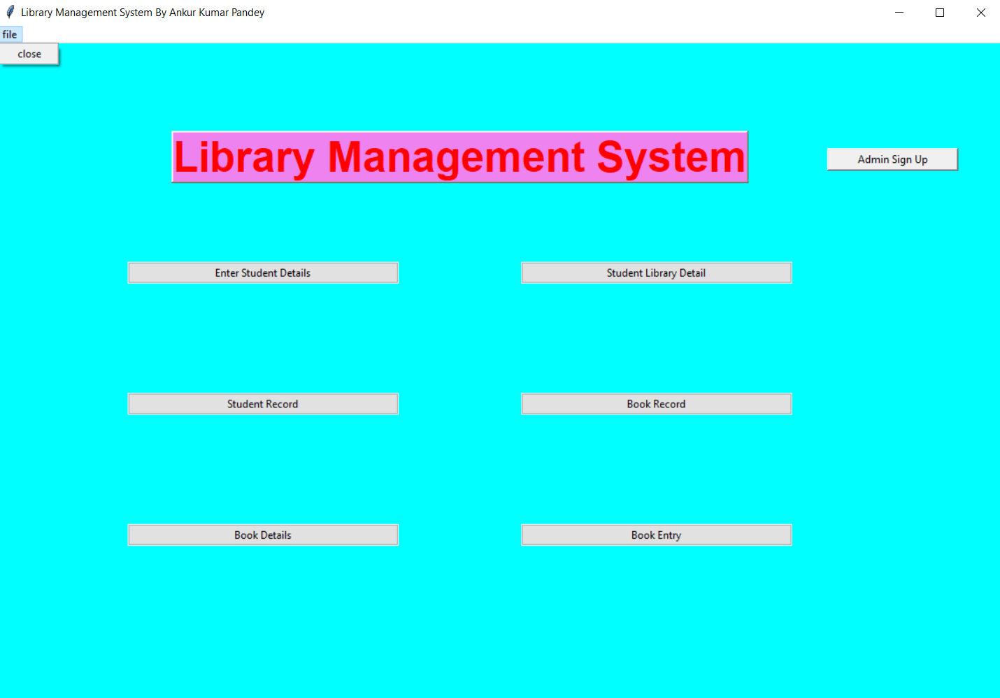
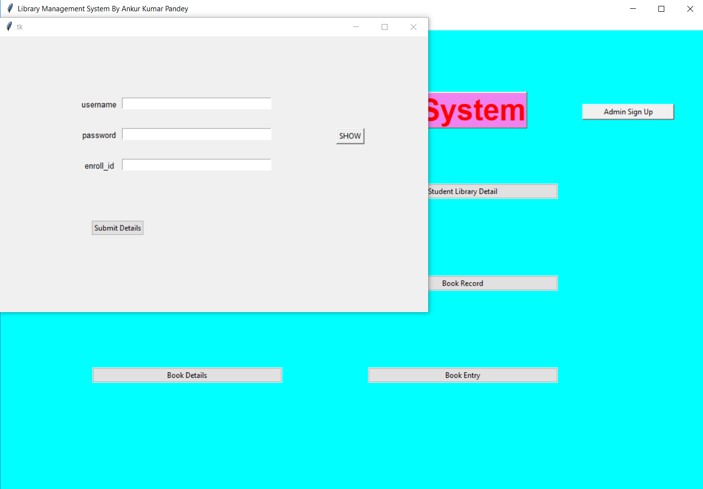
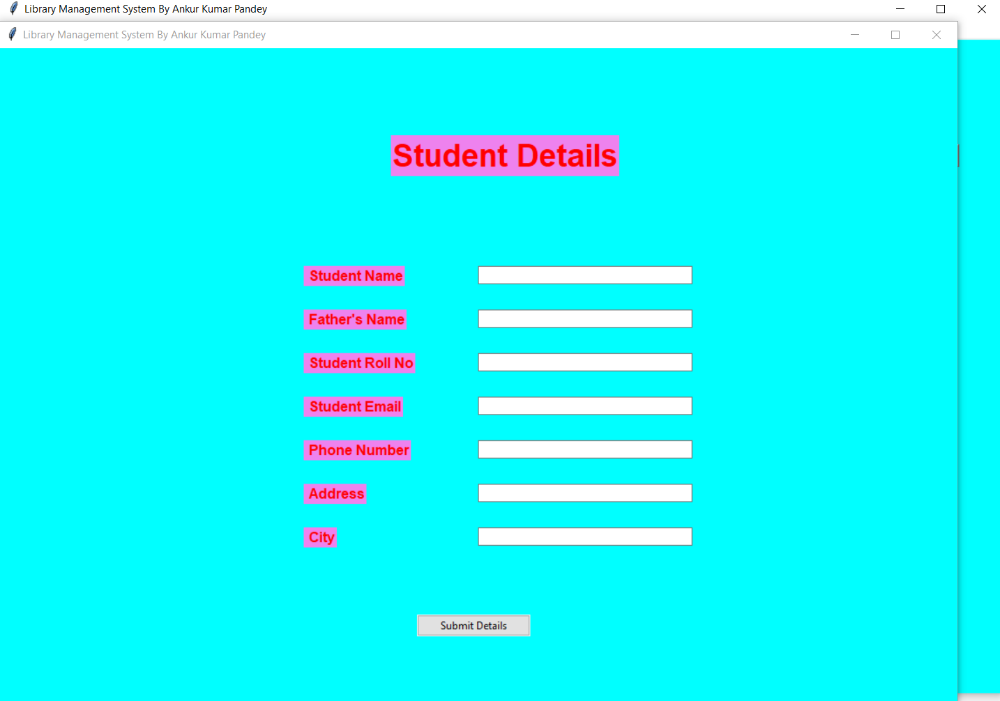
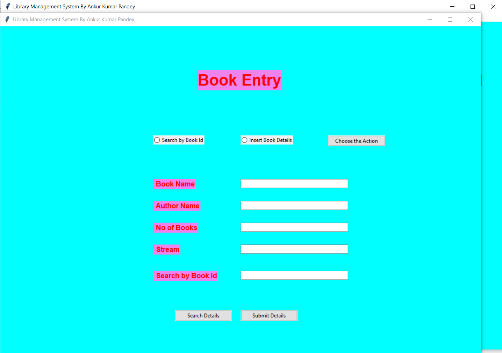
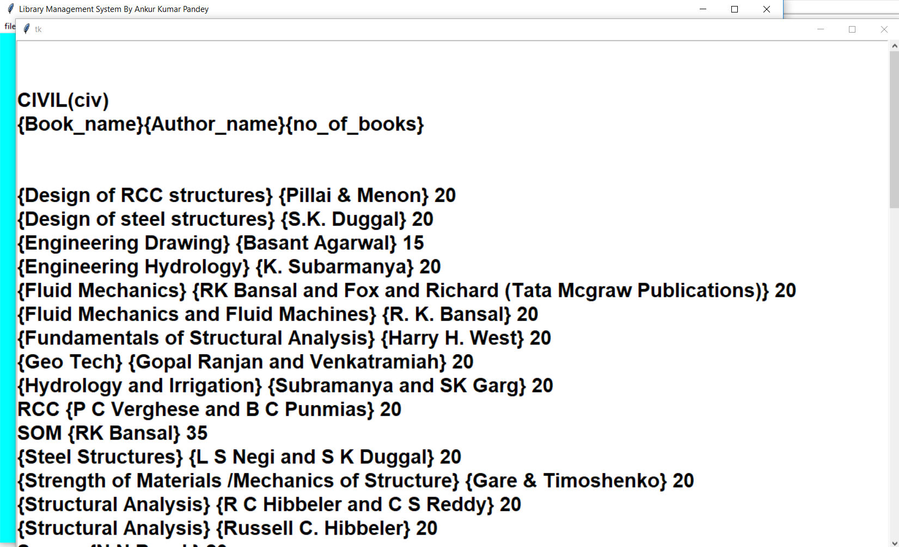
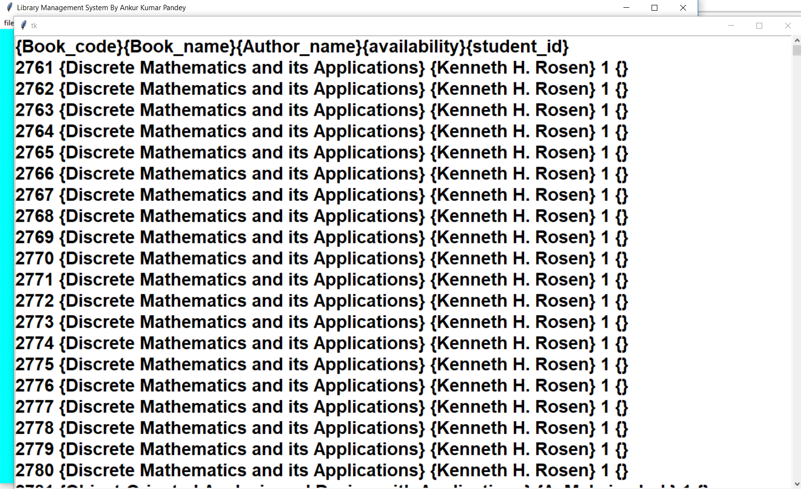
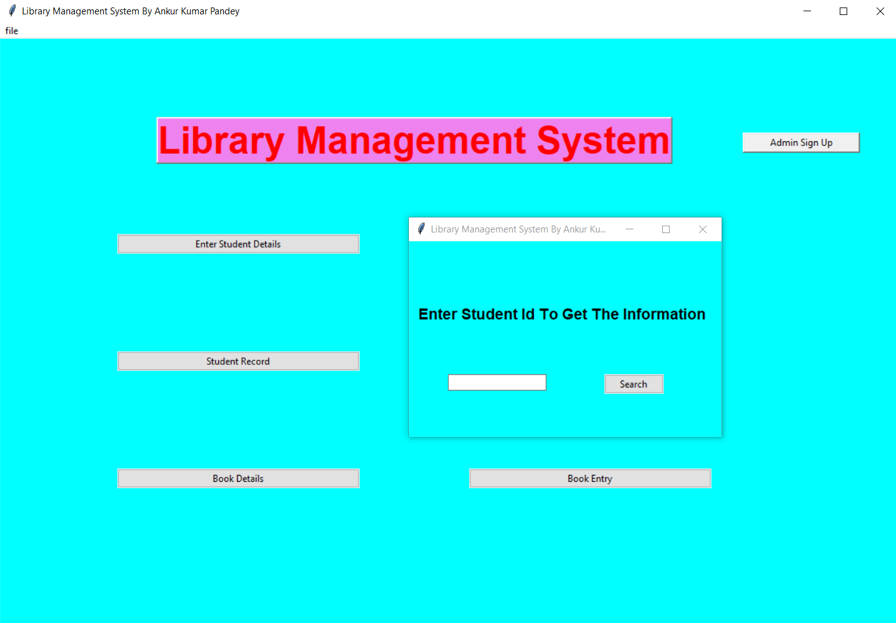

# Library Management

### The Main Window

### The Detail Entry Window

### The Book Entry Window

### The Book Details Window

### The Book Record Window

### The Student Library Detail Window

### Information
This is a work in GUI and Database Management using Python.
This type of model can be used in any type of management.

